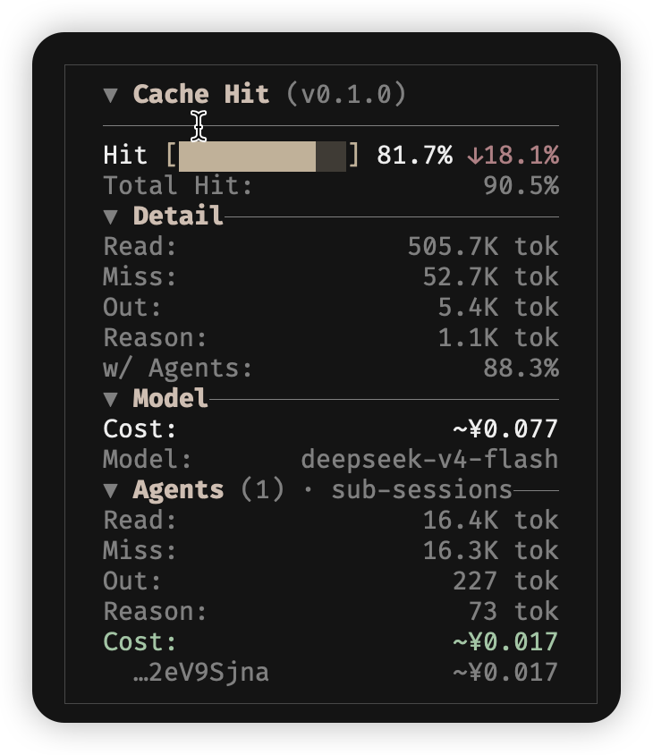

# opencode-cache-hit

[](LICENSE)

OpenCode **TUI 侧边栏插件**：展示 prompt cache 命中率、token 用量与成本；**主 session + 子 agent** 同屏汇总（默认开启主块）。可选与 [opencode-visual-cache](https://www.npmjs.com/package/opencode-visual-cache) 共存。

**语言：** [English](README.md) · 简体中文（本页）· [文档索引](docs/README.md)

## 项目意图（为什么要做这个插件）

[opencode-visual-cache](https://www.npmjs.com/package/opencode-visual-cache) 已经很好地覆盖**主 session** 的 cache 可视化（Token 分布、节省估算、斜杠改配置等）。本仓库要补的是它**刻意不做或未覆盖**的部分：

1. **子 agent 可观测性** — Task / explore 等会起子 session，需要把各子会话的 cache、token、费用**汇总**到侧栏。
2. **一场对话一块面板** — 主 session 与子 agent 同屏；**Agents** 段可折叠收起。
3. **离开 TUI 的分析** — 可选 **timeline JSONL**（按 assistant 轮次），便于画命中率曲线、jq 对账，而不去扒平台日志。
4. **可复用 TUI 骨架** — `src/tui-panel/` 抽出来，方便做其它侧栏插件。

后续（侧栏 Timeline 段、指标窗口、嵌套子 agent）见 [docs/zh-CN/timeline.md](docs/zh-CN/timeline.md)、[docs/zh-CN/design.md](docs/zh-CN/design.md)。

## 致谢与借鉴说明

本插件是**独立项目**，并非 opencode-visual-cache 官方维护。侧栏布局、面板组件（`src/tui-panel/`）及与 visual-cache **共存**的策略，**大量借鉴**自 [opencode-visual-cache](https://www.npmjs.com/package/opencode-visual-cache)：

- visual-cache：主 session **上下文 / token 分布预估**
- cache-hit：**按轮次指标、成本、子 agent 汇总**

**缓存存活时间**功能（显示已存活时间 + 颜色状态）借鉴自 [opencode-cache-timer](https://github.com/nero-sensei/opencode-cache-timer)（作者：nero-sensei）。原插件提供独立的侧边栏倒计时；本插件将该概念直接集成到缓存命中面板中。

## 截图



## 文档

| 读者 | English | 中文 |
|------|---------|------|
| 使用者 | [README.md](README.md) | 本文 |
| 维护者 | [docs/en/design.md](docs/en/design.md) | [docs/zh-CN/design.md](docs/zh-CN/design.md) |
| 时间轴 / JSONL | [docs/en/timeline.md](docs/en/timeline.md) | [docs/zh-CN/timeline.md](docs/zh-CN/timeline.md) |
| TUI 面板框架 | [src/tui-panel/README.md](src/tui-panel/README.md) | [src/tui-panel/README.zh-CN.md](src/tui-panel/README.zh-CN.md) |
| 贡献 / npm | [CONTRIBUTING.md](CONTRIBUTING.md) | — |
| AI 维护 | [AGENTS.md](AGENTS.md) | — |
| 索引 | [docs/README.md](docs/README.md) | |

## 功能一览

- **命中率**：会话累计 + 主块**单轮**命中率与趋势
- **Token 明细**：缓存读/写/未命中/输出
- **费用**：多币种配置（`USD` / `CNY` / `EUR` / `GBP` / `JPY`）；从 provider 配置读取百万 token 单价及缓存节省
- **子 agent**：**Agents** 段仅汇总**子 session**（UI 有范围提示）
- **主 session + Agents**：主块始终显示；有子 agent 时出现可折叠的 **Agents** 段
- **可选时间轴**：按天 JSONL 落盘

## 与 visual-cache 对比

**默认独立使用**（主 session + 子 agent 同面板）。版式借鉴 visual-cache，**不依赖**该插件。

| | visual-cache | cache-hit |
|---|----------------|-----------|
| 主 session 上下文 / Token **分布**估算 | 有 | 无 |
| 按角色 Token 分布 | 有 | 无 |
| 缓存**节省**、百万 token **单价** | 有 | 有（读 provider 配置） |
| **斜杠命令**改配置 | 有 | 仅配置文件 |
| **子 agent** 汇总 | 无 | **有** |
| 按次 **JSONL** | 无 | 可选 |

完整英文对照表见 [README.md](README.md#comparison-with-opencode-visual-cache)。

## 做什么、不做什么

**本插件负责**

- 主 session 与子 agent 的 cache / token / 成本聚合
- 侧边栏 **Cache Hit** 面板（布局对齐 visual-cache）
- 成本展示币种换算（默认 USD 成本 → CNY 显示）

**本插件不负责**

- 主 session 的「预估上下文 token」分布（由 visual-cache 提供）
- 修改 OpenCode 计费；`msg.cost` 仍按 `opencode.json` 美元单价

## 安装

**方式一：** `Ctrl+P` → 输入 **install plugin** → 按 `Tab` 将范围切换为 **global**（默认是 local）→ 输入 `opencode-cache-hit@latest` → 回车。

全局插件安装到 `~/.cache/opencode/packages/opencode-cache-hit@latest/`。在 `~/.config/opencode/cache-hit.json` 创建配置：

**方式二：** 编辑 `~/.config/opencode/tui.json` / `tui.jsonc`：

```json
{
  "plugin": ["./plugins/opencode-cache-hit"]
}
```

复制 `cache-hit.config.example.json` → `cache-hit.config.json`（与 `index.tsx` 同目录）。详见下文「[配置文件](#配置文件)」。

| 安装方式 | 更新后 |
|----------|--------|
| 本地路径 | 重启 |
| npm `@latest` | 重启；可删 `~/.cache/opencode/packages/opencode-cache-hit@latest` |

加载失败：`~/.local/share/opencode/log/`（搜 `cache-hit`）。

## 配置

### 成本（USD → 人民币）

```json
{
  "currency": "CNY",
  "costUnit": "USD",
  "rate": 7.2
}
```

定价与展示同为美元：`"currency": "USD", "costUnit": "USD"`。

### 展示（`display`）

```json
"display": {
  "lang": "zh",
  "panelBorder": true
}
```

| 字段 | 默认 | 含义 |
|------|------|------|
| `lang` | `"en"` | `en` / `zh` / `auto` |
| `panelBorder` | `true` | 外框与内边距 |
| `mainHitLabel` | （i18n） | 可选，覆盖 Hit 行前缀 |

**Agents 段**不含主 session token/费用（标题有「仅子会话」提示）；不需要看子 agent 时折叠 **Agents** 即可。

### 时间轴日志（`timeline`，默认关闭）

详见 [docs/zh-CN/timeline.md](docs/zh-CN/timeline.md)。

```json
"timeline": {
  "enabled": true,
  "rotateMaxBytes": 16777216,
  "retainRotated": 5,
  "maxAgeDays": 30,
  "maxLogFiles": 20
}
```

| 字段 | 代码默认 | 含义 |
|------|----------|------|
| `dir` | `""` | `logs/timeline-YYYY-MM-DD.jsonl` |
| `retainRotated` | `5` | 同日大小轮转备份数 |
| `maxLogFiles` | `0` | 超限时删**最早日期**日志 |

```fish
set log ~/.config/opencode/plugins/opencode-cache-hit/logs/timeline-(date +%Y-%m-%d).jsonl
tail -f $log
# 时间字段为 ISO 8601 含本地时区（如 "2024-05-30T08:00:00.000+08:00"）
jq -r 'select(.rootSessionId=="YOUR_ROOT") | [.created,.scope,.hitPercent,.cost]|@tsv' $log
```

轮转与清理：[docs/zh-CN/timeline.md § 轮转与清理](docs/zh-CN/timeline.md#轮转与清理)。

## 配置文件

将 `cache-hit.config.example.json` 复制为 `cache-hit.config.json`，放在包根目录（与 `index.tsx` 同级）。修改后需重启 OpenCode。

```bash
cd ~/.cache/opencode/packages/opencode-cache-hit@latest   # 或本地插件路径
cp cache-hit.config.example.json cache-hit.config.json
```

npm 打包、本地路径等说明见 [CONTRIBUTING.md](CONTRIBUTING.md)（英文）。

## 开发

```bash
bun test
```

架构：[docs/zh-CN/design.md](docs/zh-CN/design.md)。贡献 / 发布：[CONTRIBUTING.md](CONTRIBUTING.md)。AI 维护：[AGENTS.md](AGENTS.md)。

## 更新

若 npm 版本不刷新，参见 [OpenCode #6774](https://github.com/anomalyco/opencode/issues/6774)，删除 `~/.cache/opencode/packages/opencode-cache-hit@latest` 后重装并重启。

## License

MIT
