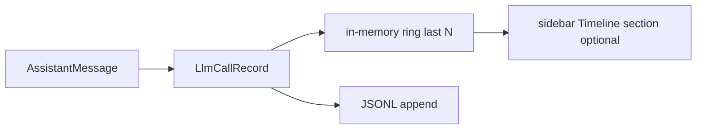
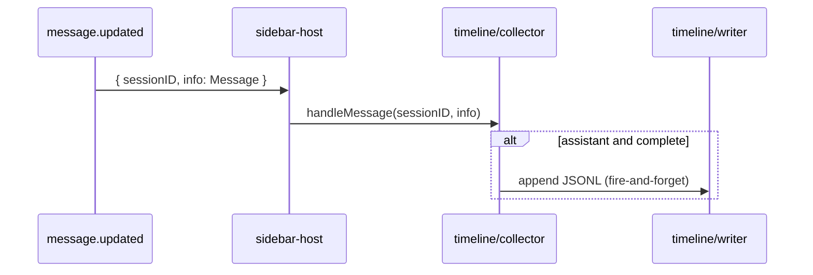

# Timeline / per-call JSONL

For developers. Sidebar aggregation: [design.md](./design.md). User guide: [README.md](../../README.md).

**Phase 1 (JSONL on disk) is implemented**; default `timeline.enabled: false`. Phase 2 sidebar Timeline section and Phase 3 metric modes are not done.

## Goals and non-goals

| Goals | Non-goals |
|-------|-----------|
| Inspect each assistant call’s tokens / cache / cost / hit % over time | Replace OpenCode platform logs (`~/.local/share/opencode/log`) |
| Distinguish main vs child sessions | Spam the TUI with `console.log` |
| Local JSONL for `jq` / scripts | Cloud upload or team sharing |
| Same rules as `stats.ts` (including `summary` skip) | SQLite, charts, or recursive sub-agents in v1 |

## Core concept

**One timeline event = one billable assistant turn**, same source as the sidebar **Hit** row—not tool parts or user messages.



| Field | Source |
|-------|--------|
| Sort key | `time.completed ?? time.created` (`timingFromAssistantMessage`) |
| Hit trend eligibility | `summary !== true` and `input + cache.read > 0` |
| Session totals | `aggregateSessionFromMessages` (may later skip `summary` too) |

## Data model

```typescript
export type LlmCallRecord = {
  schema: 1
  recordedAt: string       // ISO 8601 with local timezone offset
  sessionId: string
  rootSessionId: string    // main session; differs for child scope
  scope: "main" | "child"
  messageKey: string
  modelId: string
  providerId?: string      // Provider ID (e.g., "anthropic", "openai")
  created: string
  completedAt?: string
  durationMs?: number
  isComplete: boolean
  input: number
  output: number
  reasoning: number
  cacheRead: number
  cacheWrite: number
  cost: number
  hitPercent: number | null
  skippedForHit: boolean   // compaction / summary
  ttftMs?: number          // Time To First Token (firstPartTime - created)
  ttftSource?: "server" | "client"  // TTFT data source
  tps?: number             // Tokens Per Second (output / genTime * 1000)
  finish?: string          // Finish reason (e.g., "stop", "tool-calls", "error")
}
```

**`ttftMs` null handling**

`ttftMs` may be absent when no first-part timestamp was captured for that message. Sidebar **TTFT** uses the same tracker and works **without** `timeline.enabled`; JSONL only includes `ttftMs` when timeline logging is on.

Capture order (see [ttft-hybrid.md](./ttft-hybrid.md)):

1. `message.part.updated` — `part.time.start` on `text` / `reasoning` (server)
2. `message.part.delta` — `Date.now()` on first `text` / `reasoning` delta (client)
3. `message.updated` — scan `api.state.part()` for the earliest valid `time.start` if still missing

When all sources fail (e.g. local models with no parts), `ttftMs` is omitted — expected for some providers.

**`ttftSource` (TTFT data source)**

| Source | Description | Reliability |
|--------|-------------|-------------|
| `"server"` | `part.time.start` from part events or `api.state.part()` scan | ✅ Most accurate (excludes network latency) |
| `"client"` | `Date.now()` on first `message.part.delta` | ✅ When BusEvents are delivered |

**Priority logic**: Server timing is preferred; client replaces nothing once server is set. Invalid timestamps (`start <= created`) are dropped.

**`messageKey` (dedupe)**

1. Prefer `message.id` / `messageID`.
2. Fallback: `${sessionId}:${created}:${modelID ?? ""}`.

**Streaming**

- In-memory map keyed by `messageKey` is overwritten on each build.
- **Disk**: append when `isComplete === true` unless `flushIncomplete: true`.

## Building records

Module: `src/timeline/records.ts` — `buildCallRecords(sessionId, rootSessionId, scope, messages)`.

- Only `role === assistant`.
- `skippedForHit = msg.summary === true`.
- `hitPercent` matches `computePerCallHitTrend` per message.
- Children: `buildCallRecords(cid, rootSid, "child", …)` merged and sorted by `completedAt ?? created`.

## Storage

**Default layout**

```
~/.local/share/opencode/logs/cache-hit/
  timeline-2026-05-31.jsonl       # one active file per local calendar day
  timeline-2026-05-31.jsonl.1     # size rotation backup for that day
```

All main and child sessions for a day share one file; filter by `rootSessionId` / `sessionId` / `scope`. A new date gets a new filename at midnight.

Optional `dir` (e.g. `~/my-logs/`). Supports `~/` expansion to home directory.

**Legacy**: older builds used `<rootSessionId>.jsonl` per main session; not migrated automatically.

**Config** (`cache-hit.config.json` → `timeline`):

```json
{
  "timeline": {
    "enabled": false,
    "dir": "",
    "flushIncomplete": false,
    "logSummaryMessages": true,
    "maxMemoryRows": 50,
    "maxLinesPerFile": 100000,
    "rotateMaxBytes": 16777216,
    "retainRotated": 5,
    "maxAgeDays": 30,
    "maxLogFiles": 20
  }
}
```

Example values above; code defaults below (`enabled: false`, rotation `0` except `retainRotated: 5`).

| Field | Code default | Description |
|-------|--------------|-------------|
| `enabled` | `false` | No IO when off |
| `dir` | `""` | Empty → `~/.local/share/opencode/logs/cache-hit` |
| `flushIncomplete` | `false` | Write only completed turns |
| `logSummaryMessages` | `true` | Include summary rows (flagged) |
| `maxMemoryRows` | `50` | In-memory rows for future UI |
| `maxLinesPerFile` | `0` | Trim active file to last N lines (`0` = off) |
| `rotateMaxBytes` | `0` | Size roll to `.jsonl.1` (`0` = off) |
| `retainRotated` | `5` | Same-day backup files to keep (not counting active) |
| `maxAgeDays` | `0` | On collector start: delete files older than N days (mtime) |
| `maxLogFiles` | `0` | Cap total `timeline-*.jsonl*` files (each `.1` counts) |

**Write pipeline** (`writer.ts` + `rotation.ts`)

1. Optional size roll **before** append.
2. `appendFile` one JSON line.
3. Optional line trim **after** append.
4. Event-driven: `message.updated` → `handleMessage()` → fire-and-forget `appendFile`. No polling, no dedup.

## Rotation and retention

### Same-day size rotation (`rotateMaxBytes` + `retainRotated`)

Before each append, if the active file ≥ threshold:

```
active (full)  →  rename  →  .1
old .1         →  rename  →  .2
old .N         →  delete when at retainRotated and rolling again
new empty active file, then append
```

| `retainRotated` | Approx. max per day |
|-----------------|---------------------|
| `5` (default / example) | active + `.1`…`.5` ≈ 6× `rotateMaxBytes` |
| `1` | active + `.1` ≈ 2× |
| `0` | delete active file on roll, no backup |

Oldest backup is **deleted** on further rolls; data is gone permanently.

### Line cap (`maxLinesPerFile`)

Rewrites the **active** file in place; dropped lines are **not** moved to `.1`. With ~500 B/line records, **16MB size roll usually happens before 100k lines**.

### Directory cleanup (once per collector start)

1. `maxAgeDays`: delete `timeline-*.jsonl*` with mtime older than N days.
2. `maxLogFiles`: if still over cap, delete **earliest logs first**: oldest **date in filename**, then highest backup index (`.5` before `.1` before active); mtime only as tie-breaker.

Does **not** match legacy `ses_*.jsonl` names.

### Cross-day

New filename after midnight; previous days remain until cleanup runs.

### Collection

- `message.updated` event carries the full `Message` object. The collector subscribes directly — no polling, no dedup.
- Switching main session: `resetForRootChange()` clears in-memory cache; events for the new session arrive naturally.
- Restarts are safe: messages before startup were already written to JSONL in the previous session. No replay, no scan.

## Runtime wiring



- Child ids from `child-session-sync` / `session.list`; timeline writes main and child sessions from events.
- No debounce, no polling. Scope: current TUI root session + its children.

## UI phases

### Phase 1 — disk only (current)

```bash
LOG=~/.local/share/opencode/logs/cache-hit/timeline-$(date +%Y-%m-%d).jsonl
tail -f "$LOG"
# time fields are ISO 8601 strings with local timezone (e.g. "2024-05-30T08:00:00.000+08:00")
jq -r 'select(.rootSessionId=="YOUR_ROOT") | [.created,.scope,.hitPercent,.cost]|@tsv' "$LOG"
```

**Charts (optional scripts)** — see [scripts/README.md](../../scripts/README.md):

```bash
# one-liner: call count + average hit %
python3 -c "import json,sys; r=[json.loads(x) for x in open(sys.argv[1]) if x.strip()]; h=[x['hitPercent'] for x in r if x.get('hitPercent') is not None]; print(f\"{len(r)} calls, avg hit {sum(h)/len(h):.1f}%\")" "$LOG"

bun scripts/plot-hit-rate.ts "$LOG" -o /tmp/hit.svg
bun scripts/plot-hit-rate.ts "$LOG" --by-root -o /tmp/hit-multi.svg

# interactive HTML dashboard (filters, Chart.js); add --open to launch browser
bun scripts/timeline-dashboard.ts --open
```

Default log dir matches `timeline.dir` in plugin config (`~/.local/share/opencode/logs/cache-hit/`).

### Phase 2 — sidebar Timeline section (planned)

### Phase 3 — metric window linkage (planned)

## Module map

| Module | Role |
|--------|------|
| `message-timing.ts` | `created` / `completed` |
| `first-part-time.ts` | TTFT tracker (sidebar + JSONL input) |
| `stats.ts` | shared per-message hit % |
| `sidebar-host.tsx` | `createFirstPartTimeTracker`, `createTimelineCollector` |
| `plugin.tsx` | reads config |

## Tests

| Case | File |
|------|------|
| `buildCallRecords` | `tests/timeline-records.test.ts` |
| first-part tracker | `tests/first-part-time.test.ts` |
| writer / rotation / purge | `tests/timeline-writer.test.ts`, `timeline-rotation.test.ts` |
| collector | `tests/timeline-collector.test.ts` |

## Risks

| Risk | Mitigation |
|------|------------|
| Too many writes while streaming | `isComplete` only; debounce |
| No stable message id | synthetic `messageKey` |
| Nested sub-agents | flat `child` scope only in v1 |
| Disk growth | rotation + age + file count caps |
| SDK changes | `schema: 1` |

## Example line

```json
{"schema":1,"recordedAt":"2024-05-30T08:00:00.000+08:00","sessionId":"sess_main","rootSessionId":"sess_main","scope":"main","messageKey":"sess_main:1716999990000:deepseek/v4","modelId":"deepseek/v4","created":"2024-05-30T07:59:50.000+08:00","completedAt":"2024-05-30T08:00:00.000+08:00","durationMs":10000,"isComplete":true,"input":1200,"output":80,"reasoning":0,"cacheRead":38000,"cacheWrite":0,"cost":0.012,"hitPercent":96.9,"skippedForHit":false}
```
