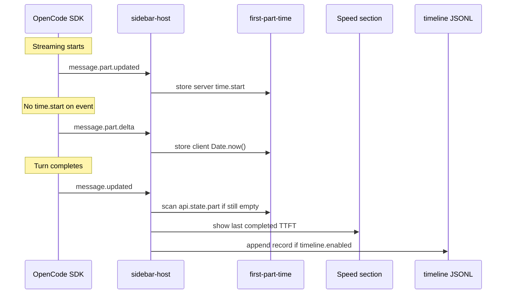

# TTFT Hybrid Implementation

This document describes how opencode-cache-hit measures **Time To First Token (TTFT)** in the sidebar **Speed** section (and in optional timeline JSONL when `timeline.enabled` is true).

## Background

OpenCode exposes optional per-part timing:

```typescript
type TextPart = {
  time?: { start: number; end?: number }  // optional
}
```

`part.time.start` is often missing because of SDK design, provider differences, proxies, event ordering, or upstream bugs (e.g. [#21544](https://github.com/anomalyco/opencode/issues/21544)). The plugin therefore combines several data sources.

**Sidebar TTFT is always collected** via `src/first-part-time.ts`. **`timeline.enabled` only controls JSONL disk writes** — not the sidebar row.

## Data sources (priority order)

### 1. Server-side timing (preferred)

| | |
|--|--|
| **Trigger** | `message.part.updated` |
| **Fields** | `part.time.start` on `text` or `reasoning` parts |
| **Formula** | `ttftMs = part.time.start - msg.time.created` |
| **Accuracy** | Best — excludes client network latency |

### 2. Client-side timing (fallback)

| | |
|--|--|
| **Trigger** | First `message.part.delta` with `field` = `text` or `reasoning` |
| **Fields** | `Date.now()` at receive time |
| **Formula** | `ttftMs = Date.now() - msg.time.created` |
| **Accuracy** | Includes network latency; depends on BusEvent delivery |

### 3. Part-state scan (fallback)

| | |
|--|--|
| **Trigger** | `message.updated` for an assistant message when no timestamp is stored yet |
| **Fields** | Earliest `part.time.start` among `text` / `reasoning` parts from `api.state.part()` |
| **Formula** | Same as source 1 |
| **Accuracy** | Same as server-side when `time.start` is present on persisted parts |

**Why `api.state.part()` is reliable**: OpenCode maintains a state store of all parts for each message. When `message.part.updated` or `message.part.delta` events don't fire (or fire after `message.updated`), we can still read the persisted `time.start` from this state. This is the most reliable fallback because it's always available when the message completes.

## Priority rules

Server timestamps win over client timestamps for the same message. Once a server value is stored, later client events are ignored. Client values can be upgraded when a valid server `time.start` arrives later.

Timestamps with `start <= msg.time.created` are discarded (clock skew / bad SDK data).

Logic lives in `createFirstPartTimeTracker()` (`src/first-part-time.ts`).

## Data flow



## Modules

| Module | Role |
|--------|------|
| `src/first-part-time.ts` | Per-message first-part timestamps |
| `src/sidebar-host.tsx` | Subscribes to part / message events |
| `src/use-cache-hit-metrics.ts` | `lastTtft` / `lastTtftLabel` for the sidebar |
| `src/timeline/collector.ts` | Writes `ttftMs` / `ttftSource` when timeline is enabled |

## Sidebar display

The **TTFT** row shows the latest **completed** non-summary assistant turn. Format: `944ms`, `1.2s`, or `"—"`.

In-flight turns show `"—"` until `time.completed` is set.

## Timeline JSONL

When `timeline.enabled: true`, each completed assistant record may include:

```typescript
{
  ttftMs?: number
  ttftSource?: "server" | "client"
}
```

Same tracker as the sidebar; see [timeline.md](./timeline.md).

## Comparison with other plugins

| Plugin | Approach |
|--------|----------|
| opencode-throughput | `part.time.start` only |
| opencode-hud | Client `performance.now()` only |
| opencode-cache-hit | Server + client + part-state scan |

## Tests

| Area | File |
|------|------|
| Tracker | `tests/first-part-time.test.ts` |
| Record fields | `tests/timeline-records.test.ts` |
| Timeline integration | `tests/timeline-collector.test.ts` |

## References

- [TTFT Troubleshooting](./ttft-troubleshooting.md)
- [OpenCode Issue #21544](https://github.com/anomalyco/opencode/issues/21544)
- [OpenCode Issue #26924](https://github.com/anomalyco/opencode/issues/26924)
- [OpenCode Issue #27663](https://github.com/anomalyco/opencode/issues/27663)
- [OpenCode Issue #23673](https://github.com/anomalyco/opencode/issues/23673)
