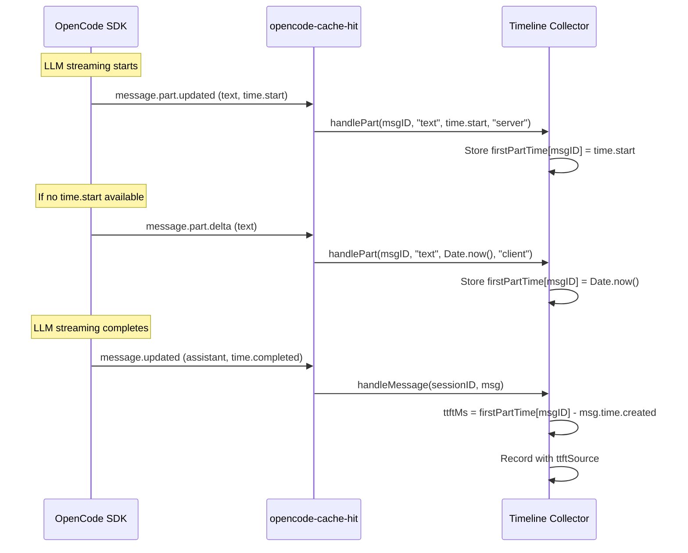

# TTFT Hybrid Implementation

This document explains the hybrid Time To First Token (TTFT) measurement approach used in opencode-cache-hit, which combines server-side and client-side timing to maximize reliability.

## Problem Statement

OpenCode's `TextPart.time` field is **optional** in the SDK type definition:

```typescript
type TextPart = {
  time?: { start: number; end?: number }  // Optional!
}
```

This means `part.time?.start` is frequently `undefined`, causing TTFT calculations to fail. The root causes include:

1. **SDK design** - `TextPart.time` is optional, not all providers set it
2. **Provider differences** - Some providers don't return timing data
3. **Proxy/OpenRouter** - Intermediary layers may strip timing data
4. **Event ordering** - `message.part.updated` may fire before `time.start` is set
5. **Known SDK bugs** - Issue #21544 where `text-end` overwrote `time.start`

## Solution: Hybrid TTFT Measurement

The plugin uses a two-source approach:

### Source 1: Server-side TTFT (Preferred)

**Event**: `message.part.updated`
**Data**: `part.time.start`
**Formula**: `ttftMs = part.time.start - msg.time.created`

**Pros**:
- Most accurate (excludes network latency)
- Reflects actual server-side first token time

**Cons**:
- Frequently unavailable (optional field)
- Subject to SDK bugs and provider limitations

### Source 2: Client-side TTFT (Fallback)

**Event**: `message.part.delta` (first occurrence)
**Data**: `Date.now()`
**Formula**: `ttftMs = Date.now() - msg.time.created`

**Pros**:
- Always available
- Not affected by SDK bugs or provider limitations

**Cons**:
- Includes network latency
- May be slightly less accurate than server-side

## Priority Logic

```typescript
const handlePart = (messageID, partType, startTime, source) => {
  const existing = firstPartTime.get(messageID)
  const existingSource = firstPartSource.get(messageID)
  
  // Prefer server-side TTFT
  if (existing !== undefined && existingSource === "server") {
    return  // Already have server-side TTFT, ignore client-side
  }
  
  // Replace client-side with server-side when available
  if (existing !== undefined && existingSource === "client" && source === "server") {
    firstPartTime.set(messageID, startTime)
    firstPartSource.set(messageID, source)
    return
  }
  
  // First time setting
  if (existing === undefined) {
    firstPartTime.set(messageID, startTime)
    firstPartSource.set(messageID, source)
  }
}
```

## Data Flow



## Implementation Details

### Event Handling

```typescript
// sidebar-host.tsx

// Server-side TTFT (preferred)
createEffect(() => {
  const unsub = props.api.event.on("message.part.updated", (event) => {
    const part = event.properties?.part
    if (part?.type === "text" && part?.time?.start && part?.messageID) {
      timeline.handlePart(part.messageID, part.type, part.time.start, "server")
    }
  })
})

// Client-side TTFT (fallback)
createEffect(() => {
  const unsub = props.api.event.on("message.part.delta", (event) => {
    const props = event.properties
    if (props?.field === "text" && props?.messageID) {
      timeline.handlePart(props.messageID, "text", Date.now(), "client")
    }
  })
})
```

### Data Storage

```typescript
// timeline/collector.ts
const firstPartTime = new Map<string, number>()
const firstPartSource = new Map<string, "server" | "client">()
```

### Record Output

```typescript
// timeline/types.ts
export type LlmCallRecord = {
  ttftMs?: number
  ttftSource?: "server" | "client"
  // ... other fields
}
```

## Comparison with Other Plugins

| Plugin | TTFT Approach | Reliability |
|--------|---------------|-------------|
| **opencode-throughput** | `part.time?.start` only | ❌ Frequently null |
| **opencode-hud** | `performance.now()` only | ✅ Always available |
| **opencode-tps-counter** | Hybrid (recommended) | ✅ Best of both |
| **opencode-cache-hit** | Hybrid (this plugin) | ✅ Best of both |

## Testing

The implementation includes comprehensive tests:

```typescript
test("preserves ttftSource when provided", () => {
  const rec = assistantMessageToRecord(msg, "s1", "root", "main", 5000, 1500, "server")
  expect(rec!.ttftSource).toBe("server")
})

test("ttftSource undefined when not provided", () => {
  const rec = assistantMessageToRecord(msg, "s1", "root", "main", 5000, 1500)
  expect(rec!.ttftSource).toBeUndefined()
})
```

## Future Improvements

1. **UI indication** - Show TTFT source in the sidebar (server vs client)
2. **Statistics** - Track TTFT availability by provider
3. **Configuration** - Allow users to prefer one source over another
4. **Fallback chain** - Add more fallback sources (e.g., reasoning part timing)

## References

- [OpenCode SDK TextPart type](https://github.com/anomalyco/opencode/blob/dev/packages/opencode/src/session/message-v2.ts)
- [OpenCode Issue #21544](https://github.com/anomalyco/opencode/issues/21544) - text-end overwrites time.start
- [OpenCode Issue #26924](https://github.com/anomalyco/opencode/issues/26924) - message.part.updated arrives after message.part.delta
- [opencode-throughput](https://github.com/Howardzhangdqs/opencode-throughput) - Reference implementation
- [opencode-hud](https://github.com/Alaye-Dong/opencode-hud) - Alternative approach using performance.now()
