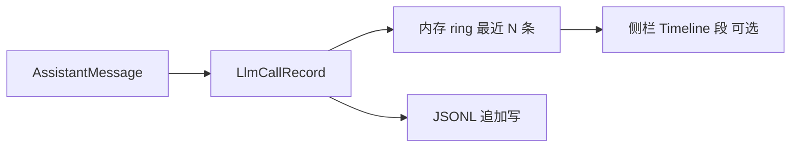
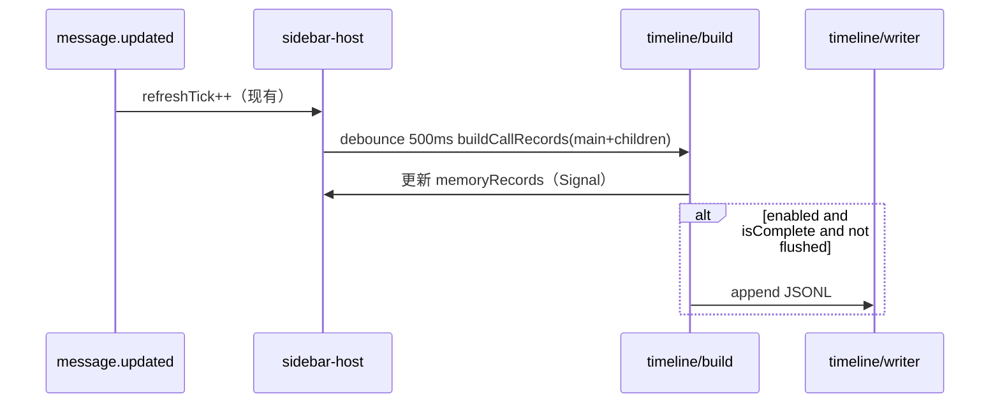

# 时间轴 / 按次日志 — 设计方案

面向开发者。侧栏聚合见 [design.md](./design.md)。用户指南见 [README.zh-CN.md](../../README.zh-CN.md)。

**Phase 1（JSONL 落盘）已实现**，默认 `timeline.enabled: false`。Phase 2 侧栏 Timeline 段、Phase 3 指标切换仍未做。

## 目标与非目标

| 目标 | 非目标 |
|------|--------|
| 按时间查看每次 assistant 调用的 token / cache / cost / 命中率 | 替代 OpenCode 平台日志（`~/.local/share/opencode/log`） |
| 区分主 session 与子 session 的调用 | 在 TUI 里实时 `console.log` 刷屏 |
| 本地落盘，便于事后用 jq / 脚本分析 | 上传云端、团队共享 |
| 与现有 `stats.ts` 口径一致（含 `summary` 跳过规则） | 第一期就做 SQLite、图表、递归子 agent |

## 核心概念

**一条时间轴事件 = 一次「可计费的 assistant 轮次」**，与侧栏顶栏 **Hit** 行同源，不是 tool part、不是 user 消息。



| 字段 | 来源 |
|------|------|
| 时间排序键 | `time.completed ?? time.created`（已有 `timingFromAssistantMessage`） |
| 是否计入 Hit 趋势 | `summary !== true` 且 `input + cache.read > 0`（对齐 `computePerCallHitTrend`） |
| 会话累计 | 仍用 `aggregateSessionFromMessages`（可后续让累计也跳过 `summary`） |

## 数据模型

```typescript
/** 单条记录；JSONL 一行一个 */
export type LlmCallRecord = {
  schema: 1
  /** 写入时间（本机 ms），非 LLM 时间 */
  recordedAt: number
  /** 所属 session */
  sessionId: string
  /** 主 session id；子 session 时与 sessionId 不同 */
  rootSessionId: string
  scope: "main" | "child"
  /** OpenCode message id；SDK 若无则用稳定合成键，见下文 */
  messageKey: string
  modelId: string
  created: number
  completedAt?: number
  durationMs?: number
  isComplete: boolean
  input: number
  output: number
  reasoning: number
  cacheRead: number
  cacheWrite: number
  cost: number
  /** 单轮 cache 命中率 0–100；无分母时为 null */
  hitPercent: number | null
  /** compaction / summary 消息 */
  skippedForHit: boolean
}
```

**`messageKey`（去重键）**

1. 优先：`message.id` / `messageID`（实现前用真实 SDK 样本确认字段名，扩展 `AssistantMessage` 类型）。
2. 回退：`${sessionId}:${created}:${modelID ?? ""}`（同一 created 极罕见碰撞；流式更新时 created 不变，可覆盖同键）。

**流式更新策略**

- `message.updated` 频繁触发时，**内存 Map<messageKey, LlmCallRecord>** 覆盖更新同一键。
- **落盘**：仅在 `isComplete === true` 时 append 一行；或配置 `flushIncomplete: true` 时也写，行带 `isComplete`，便于分析 in-flight（默认 `false`，减少 JSONL 噪音）。
- 未完成行在 TUI 时间轴里可显示为 `…` 后缀（可选）。

## 从消息构建记录

新建纯函数模块 `src/timeline/records.ts`（不依赖 JSX）：

```typescript
export function buildCallRecords(
  sessionId: string,
  rootSessionId: string,
  scope: "main" | "child",
  messages: readonly AssistantMessage[],
): LlmCallRecord[]
```

逻辑要点：

- 只处理 `role === assistant`。
- `skippedForHit = msg.summary === true`。
- `hitPercent`：与 `computePerCallHitTrend` 单条算法一致；`skippedForHit` 时可为 `null` 仍保留 token/cost 行（配置项 `logSummaryMessages`，默认 `true` 但标记 `skippedForHit`）。

子 session：在 `sidebar-host` 已有 `childIds` 与 `refreshTick` 上，对每个 `cid` 调用 `buildCallRecords(cid, rootSid, "child", messages)`，与主 session 记录合并后按 `sortKey = completedAt ?? created` 排序。

## 存储

**默认路径（可配置）**

```
~/.local/share/opencode/logs/cache-hit/
  timeline-2026-05-31.jsonl       # 按本地日历日一个活跃文件
  timeline-2026-05-31.jsonl.1     # 当日超过 rotateMaxBytes 时链式备份
```

所有主/子 session 的调用写入**同一天**的同一文件；用行内 `rootSessionId` / `sessionId` / `scope` 筛某场对话。跨日自动切到新文件名。

`dir` 非空时可改到例如 `~/my-logs/`，支持 `~/` 展开为 home 目录。

推荐 **JSONL** 第一期：实现简单、`tail -f` / `jq` 友好；SQLite 留给第二期索引查询。

**与旧版**：曾用 `<rootSessionId>.jsonl` 按主会话分文件；现改为按天。旧文件不会被自动迁移，可手动删除或保留。

**配置**（并入 `cache-hit.config.json` 的 `timeline` 段）：

```json
{
  "timeline": {
    "enabled": false,
    "dir": "",
    "flushIncomplete": false,
    "logSummaryMessages": true,
    "maxMemoryRows": 50,
    "maxLinesPerFile": 100000,
    "rotateMaxBytes": 16777216,
    "retainRotated": 5,
    "maxAgeDays": 30,
    "maxLogFiles": 20
  }
}
```

上表为 **example 推荐值**；代码默认见下表（`enabled: false`，轮转项为 `0`）。

| 字段 | 代码默认 | 说明 |
|------|----------|------|
| `enabled` | `false` | 关闭时零 IO，不影响侧栏 |
| `dir` | `""` | 空则用 `~/.local/share/opencode/logs/cache-hit` |
| `flushIncomplete` | `false` | 是否在未完成时写 JSONL |
| `logSummaryMessages` | `true` | 是否记录 summary 行 |
| `maxMemoryRows` | `50` | TUI 内存中保留条数（全量仍可从文件读） |
| `maxLinesPerFile` | `0` | 活跃文件只保留最后 N 行（`0` = 不限） |
| `rotateMaxBytes` | `0` | 活跃文件 ≥ 该字节数时滚到 `.jsonl.1`（`0` = 关闭） |
| `retainRotated` | `5` | 同日大小轮转保留的**备份**个数（不含正在写的活跃文件） |
| `maxAgeDays` | `0` | collector **启动时**删除超 N 天的 `timeline-*.jsonl*` |
| `maxLogFiles` | `0` | 日志目录内 `timeline-*.jsonl*` 总数上限（每个 `.1` 单独计数） |

**写入流程**（`src/timeline/writer.ts` + `rotation.ts`）

1. 可选 `rotateMaxBytes`：写**前**若当日活跃文件 ≥ 阈值 → 链式 rename（见 § 轮转与清理）。
2. `appendFile` 一行 JSON。
3. 可选 `maxLinesPerFile`：写**后**读回活跃文件，只保留最后 N 行（**删行**，不生成 `.1`）。
4. 异步：`collector` 在 `queueMicrotask` 里写盘；`flushedKeys` 按 `messageKey` 去重（切换主 session **不**清空；跨日换文件名时清空）。

## 轮转与清理

### 同日大小轮转（`rotateMaxBytes` + `retainRotated`）

仅作用于**当天**活跃文件 `timeline-YYYY-MM-DD.jsonl`。写下一条记录**之前**检查大小。

```
活跃 (将满)  →  rename →  .1
原 .1        →  rename →  .2
原 .N        →  删除（当备份数已达 retainRotated 且再次轮转时）
然后新建空的 活跃 文件，继续 append
```

| `retainRotated` | 当日最多占用（约） |
|-----------------|-------------------|
| `5`（默认 / example） | 活跃 + `.1`…`.5` ≈ 6× `rotateMaxBytes` |
| `1` | 活跃 + `.1` ≈ 2× `rotateMaxBytes` |
| `0` | 满则**删掉**活跃文件，不保留备份 |

再满时最老备份**整文件删除**，更早的调用不可恢复。同时注意 `maxLogFiles`（每个备份各占 1 个文件槽）；繁忙日 + `retainRotated: 5` 时更易触达目录文件数上限。

### 行数截断（`maxLinesPerFile`）

写**后**对**当日活跃文件**原地重写，只留最后 N 行；**不会**把删掉的行挪到 `.1`。

与 `rotateMaxBytes` 同时开启时，通常**先碰到字节上限**（当前记录约 500B/行，16MB ≈ 3.4 万行，远小于 example 的 10 万行）。

### 目录清理（collector 启动时一次）

1. `maxAgeDays`：删除 mtime 超过 N 天的所有 `timeline-*.jsonl*`。
2. `maxLogFiles`：若仍多于 N 个文件，按**日志时间先后**删到剩 N 个：先删文件名里**最早日期**的；同一天先删 `.5`、`.4`…再删活跃文件（与 mtime 无关，避免 `touch` 误留旧日文件）。

**不匹配**旧版 `<rootSessionId>.jsonl`，不会自动删；可手动清理。

### 跨日

午夜后自动写入新文件名；昨日文件保留，直至上述清理策略删除。

### 去重与切换 session

- 同一 `messageKey` 只 append 一次（进程内 `flushedKeys`）。
- 切换 TUI 主 session：仍写**同日**文件，用 `rootSessionId` 过滤；**不**因切换而重复写同一 `messageKey`。
- 插件重启后 `flushedKeys` 为空，可能对**同一批已完成消息**再写一遍（若需避免，需另做持久化去重，当前未做）。

## 运行时接入



- **与 `child-session-sync` 分工**：子 id 列表仍由 `session.list` 负责；时间轴只读 `messages()`，不额外 list。
- **Debounce**：500ms（比 child list 的 200ms 略长，减少流式写盘）；仅 `timeline.enabled` 时注册。
- **作用域**：只记录「当前 TUI 绑定的 `rootSessionId`」及其子 session；落盘路径按**当天**不变，切换主 session 仍写同一日文件。

## UI（分阶段）

### Phase 1 — 仅落盘（推荐先做）

- 无侧栏改动；用户 `tail -f` / `jq` 分析。
- 文档示例：

```bash
LOG=~/.local/share/opencode/logs/cache-hit/timeline-$(date +%Y-%m-%d).jsonl
tail -f $LOG
jq -r 'select(.rootSessionId=="YOUR_ROOT") | [.created,.scope,.hitPercent,.cost]|@tsv' $LOG
```

**画图（可选脚本）** — 见 [scripts/README.md](../../scripts/README.md)：

```bash
python3 -c "import json,sys; r=[json.loads(x) for x in open(sys.argv[1]) if x.strip()]; h=[x['hitPercent'] for x in r if x.get('hitPercent') is not None]; print(f\"{len(r)} calls, avg hit {sum(h)/len(h):.1f}%\")" $LOG

bun scripts/plot-hit-rate.ts $LOG -o /tmp/hit.svg
bun scripts/plot-hit-rate.ts $LOG --by-root -o /tmp/hit-multi.svg
```

### Phase 2 — 侧栏「Timeline」折叠段

- 在 `widget.tsx` 增加 `TuiSection`，展示最近 `maxMemoryRows` 条（窄屏每行一条）：
  - `HH:mm:ss · main · 99.2% · ¥0.02`
  - `HH:mm:ss · child …abc · 85.0% · 12k tok`
- 不打开文件即可扫一眼；点击/快捷键打开文件路径（若 OpenCode 支持 `open` 再议）。

### Phase 3 — 指标切换联动

- 与 design 里「累计 / 最近 N 轮」共用 `buildCallRecords`：
  - `window: "session" | "last1" | "lastN"`
  - 侧栏 Hit 行可选显示「最近一轮」而非「最后一条非 summary」（与 JSONL 一致）。

## 与现有模块关系

| 模块 | 关系 |
|------|------|
| `message-timing.ts` | 提供 `created` / `completed` / `formatTimingShort` |
| `stats.ts` | 抽出共享 `perMessageHitPercent(msg)`，供 `computePerCallHitTrend` 与 `buildCallRecords` 共用 |
| `sidebar-host.tsx` | 挂载 `createTimelineCollector`（enabled 时） |
| `plugin.tsx` | 无改动或仅读 config |

## 测试

| 用例 | 文件 |
|------|------|
| `buildCallRecords` 排序、summary、hitPercent | `tests/timeline-records.test.ts` |
| 合成 `messageKey`、完成才 flush | `tests/timeline-writer.test.ts`（临时目录） |
| 不启用时 writer 不被调用 | 可选 mock |

## 风险与约束

| 风险 | 缓解 |
|------|------|
| 流式写盘过多 | 默认仅 `isComplete` 落盘；debounce |
| 无 message id | 合成键 + 完成时覆盖内存 |
| 子 agent 嵌套 | 第一期只 `scope: child` 平铺；递归列入 Phase 4 |
| 磁盘膨胀 | `maxLinesPerFile` / `rotateMaxBytes` / `maxAgeDays`（已实现） |
| SDK 字段变更 | `schema: 1`；迁移时新文件或兼容读取 |

## 实施顺序（建议）

1. `timeline/records.ts` + 测试 + `stats` 抽取单条命中率  
2. `timeline/writer.ts` + config + `sidebar-host` 接入（**enabled: false 默认**）  
3. README 一段：如何开启、JSONL 路径、jq 示例  
4. Phase 2 侧栏 Timeline 段（可选）  
5. SQLite / 图表（远期）

## 示例 JSONL 行

```json
{"schema":1,"recordedAt":1717000000000,"sessionId":"sess_main","rootSessionId":"sess_main","scope":"main","messageKey":"sess_main:1716999990000:deepseek/v4","modelId":"deepseek/v4","created":1716999990000,"completedAt":1717000000000,"durationMs":10000,"isComplete":true,"input":1200,"output":80,"reasoning":0,"cacheRead":38000,"cacheWrite":0,"cost":0.012,"hitPercent":96.9,"skippedForHit":false}
```

---

维护说明：design.md「未来方向」中与按次日志相关的条目以本文 Phase 状态为准。
