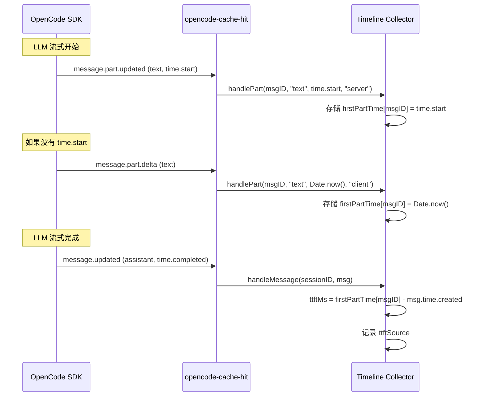

# TTFT 混合实现方案

本文档解释了 opencode-cache-hit 中使用的混合首 Token 延迟（TTFT）测量方法，该方法结合了服务器端和客户端时序以最大化可靠性。

## 问题陈述

OpenCode 的 `TextPart.time` 字段在 SDK 类型定义中是**可选的**：

```typescript
type TextPart = {
  time?: { start: number; end?: number }  // 可选！
}
```

这意味着 `part.time?.start` 经常为 `undefined`，导致 TTFT 计算失败。根本原因包括：

1. **SDK 设计** - `TextPart.time` 是可选字段，不是所有 provider 都设置
2. **Provider 差异** - 某些 provider 不返回时序数据
3. **代理/OpenRouter** - 中间层可能丢失时序数据
4. **事件顺序** - `message.part.updated` 可能在 `time.start` 被设置之前触发
5. **已知 SDK Bug** - Issue #21544 中 `text-end` 覆盖了 `time.start`

## 解决方案：混合 TTFT 测量

插件使用双源方法：

### 来源 1：服务器端 TTFT（优先）

**事件**：`message.part.updated`
**数据**：`part.time.start`
**公式**：`ttftMs = part.time.start - msg.time.created`

**优点**：
- 最精确（不含网络延迟）
- 反映实际的服务器端首 Token 时间

**缺点**：
- 经常不可用（可选字段）
- 受 SDK Bug 和 provider 限制影响

### 来源 2：客户端 TTFT（兜底）

**事件**：`message.part.delta`（首次出现）
**数据**：`Date.now()`
**公式**：`ttftMs = Date.now() - msg.time.created`

**优点**：
- 始终可用
- 不受 SDK Bug 或 provider 限制影响

**缺点**：
- 包含网络延迟
- 可能不如服务器端精确

## 优先级逻辑

```typescript
const handlePart = (messageID, partType, startTime, source) => {
  const existing = firstPartTime.get(messageID)
  const existingSource = firstPartSource.get(messageID)
  
  // 优先使用服务器端 TTFT
  if (existing !== undefined && existingSource === "server") {
    return  // 已有服务器端 TTFT，忽略客户端 TTFT
  }
  
  // 当服务器端可用时，替换客户端 TTFT
  if (existing !== undefined && existingSource === "client" && source === "server") {
    firstPartTime.set(messageID, startTime)
    firstPartSource.set(messageID, source)
    return
  }
  
  // 首次设置
  if (existing === undefined) {
    firstPartTime.set(messageID, startTime)
    firstPartSource.set(messageID, source)
  }
}
```

## 数据流



## 实现细节

### 事件处理

```typescript
// sidebar-host.tsx

// 服务器端 TTFT（优先）
createEffect(() => {
  const unsub = props.api.event.on("message.part.updated", (event) => {
    const part = event.properties?.part
    if (part?.type === "text" && part?.time?.start && part?.messageID) {
      timeline.handlePart(part.messageID, part.type, part.time.start, "server")
    }
  })
})

// 客户端 TTFT（兜底）
createEffect(() => {
  const unsub = props.api.event.on("message.part.delta", (event) => {
    const props = event.properties
    if (props?.field === "text" && props?.messageID) {
      timeline.handlePart(props.messageID, "text", Date.now(), "client")
    }
  })
})
```

### 数据存储

```typescript
// timeline/collector.ts
const firstPartTime = new Map<string, number>()
const firstPartSource = new Map<string, "server" | "client">()
```

### 记录输出

```typescript
// timeline/types.ts
export type LlmCallRecord = {
  ttftMs?: number
  ttftSource?: "server" | "client"
  // ... 其他字段
}
```

## 与其他插件的对比

| 插件 | TTFT 方法 | 可靠性 |
|------|-----------|--------|
| **opencode-throughput** | 仅 `part.time?.start` | ❌ 经常为 null |
| **opencode-hud** | 仅 `performance.now()` | ✅ 始终可用 |
| **opencode-tps-counter** | 混合方法（推荐） | ✅ 两全其美 |
| **opencode-cache-hit** | 混合方法（本插件） | ✅ 两全其美 |

## 测试

实现包含全面的测试：

```typescript
test("保留 ttftSource 当提供时", () => {
  const rec = assistantMessageToRecord(msg, "s1", "root", "main", 5000, 1500, "server")
  expect(rec!.ttftSource).toBe("server")
})

test("ttftSource 未提供时为 undefined", () => {
  const rec = assistantMessageToRecord(msg, "s1", "root", "main", 5000, 1500)
  expect(rec!.ttftSource).toBeUndefined()
})
```

## 未来改进

1. **UI 指示** - 在侧边栏中显示 TTFT 来源（服务器 vs 客户端）
2. **统计** - 按 provider 追踪 TTFT 可用性
3. **配置** - 允许用户偏好某个来源
4. **回退链** - 添加更多回退来源（例如 reasoning part 时序）

## 参考资料

- [OpenCode SDK TextPart 类型](https://github.com/anomalyco/opencode/blob/dev/packages/opencode/src/session/message-v2.ts)
- [OpenCode Issue #21544](https://github.com/anomalyco/opencode/issues/21544) - text-end 覆盖 time.start
- [OpenCode Issue #26924](https://github.com/anomalyco/opencode/issues/26924) - message.part.updated 在 message.part.delta 之后到达
- [opencode-throughput](https://github.com/Howardzhangdqs/opencode-throughput) - 参考实现
- [opencode-hud](https://github.com/Alaye-Dong/opencode-hud) - 使用 performance.now() 的替代方案
