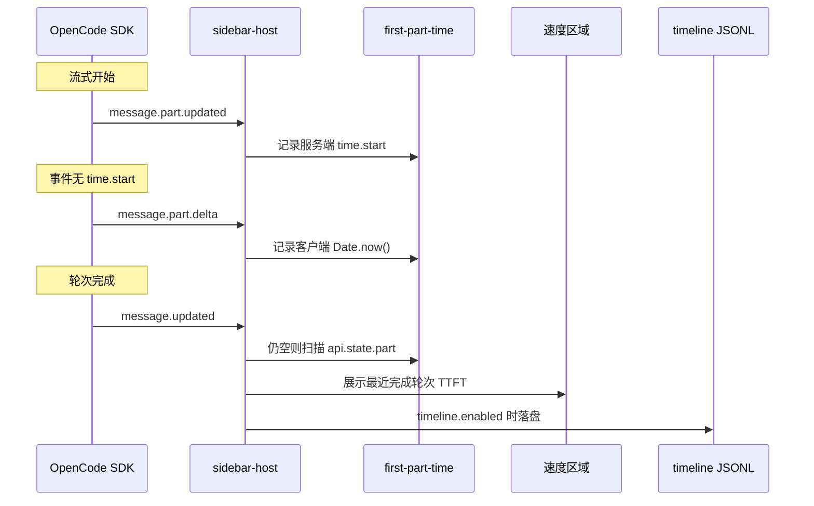

# TTFT 混合实现方案

本文档说明 opencode-cache-hit 如何在侧边栏 **速度** 区域（以及可选的 timeline JSONL，`timeline.enabled: true` 时）测量 **首 Token 延迟（TTFT）**。

## 背景

OpenCode 的 part 时序字段是可选的：

```typescript
type TextPart = {
  time?: { start: number; end?: number }  // 可选
}
```

`part.time.start` 常因 SDK 设计、provider 差异、代理、事件顺序或上游 bug（如 [#21544](https://github.com/anomalyco/opencode/issues/21544)）而缺失。插件因此组合多个数据源。

**侧边栏 TTFT 始终采集**，由 `src/first-part-time.ts` 负责。**`timeline.enabled` 仅控制 JSONL 落盘**，不影响侧边栏行。

## 数据源（按优先级）

### 1. 服务端时序（优先）

| | |
|--|--|
| **触发** | `message.part.updated` |
| **字段** | `text` / `reasoning` part 的 `part.time.start` |
| **公式** | `ttftMs = part.time.start - msg.time.created` |
| **精度** | 最高 — 不含客户端网络延迟 |

### 2. 客户端时序（兜底）

| | |
|--|--|
| **触发** | 首个 `field` 为 `text` 或 `reasoning` 的 `message.part.delta` |
| **字段** | 收到时的 `Date.now()` |
| **公式** | `ttftMs = Date.now() - msg.time.created` |
| **精度** | 含网络延迟；依赖 BusEvent 是否正常投递 |

### 3. Part 状态扫描（兜底）

| | |
|--|--|
| **触发** | assistant 消息的 `message.updated`，且尚无已存时间戳 |
| **字段** | `api.state.part()` 中 `text` / `reasoning` 最早的 `part.time.start` |
| **公式** | 与来源 1 相同 |
| **精度** | part 已持久化且带 `time.start` 时与服务端等价 |

**`api.state.part()` 的作用**：OpenCode 按消息维护 part 状态。part 事件缺失或晚到时，可在 `message.updated` 扫描最早的合法 `time.start`。仅当 parts 已持久化且含时序时有效；部分后端（如无 parts 表的本地模型）仍无可用 `time.start` — 见 [ttft-troubleshooting.md](./ttft-troubleshooting.md)。

## 优先级规则

同一消息上，服务端时间戳优先于客户端。已有服务端记录后，后续客户端事件被忽略。若更晚到达有效的服务端 `time.start`，可覆盖先前的客户端值。

`start <= msg.time.created` 的时间戳会被丢弃（时钟偏差或异常 SDK 数据）。

逻辑位于 `createFirstPartTimeTracker()`（`src/first-part-time.ts`）。

## 数据流



## 模块分工

| 模块 | 职责 |
|------|------|
| `src/first-part-time.ts` | 按消息记录首 part 时间 |
| `src/sidebar-host.tsx` | 订阅 part / message 事件 |
| `src/use-cache-hit-metrics.ts` | 侧边栏 `lastTtft` / `lastTtftLabel` |
| `src/timeline/collector.ts` | timeline 开启时写入 `ttftMs` / `ttftSource` |

## 侧边栏展示

展示最近一条**已完成**、非 summary 的 assistant 轮次（`944ms`、`1.2s` 或 `"—"`）。展示规则与排查见 [ttft-troubleshooting.md](./ttft-troubleshooting.md)。

## Timeline JSONL

`timeline.enabled: true` 时，每条已完成的 assistant 记录可包含：

```typescript
{
  ttftMs?: number
  ttftSource?: "server" | "client"
}
```

与侧边栏共用同一 tracker；详见 [timeline.md](./timeline.md)。

## 与其他插件对比

| 插件 | 方式 |
|------|------|
| opencode-throughput | 仅 `part.time.start` |
| opencode-hud | 仅客户端 `performance.now()` |
| opencode-cache-hit | 服务端 + 客户端 + part 状态扫描 |

## 测试

| 范围 | 文件 |
|------|------|
| Tracker | `tests/first-part-time.test.ts` |
| 记录字段 | `tests/timeline-records.test.ts` |
| Timeline 集成 | `tests/timeline-collector.test.ts` |

## 参考资料

- [TTFT 故障排除](./ttft-troubleshooting.md)
- [OpenCode Issue #21544](https://github.com/anomalyco/opencode/issues/21544)
- [OpenCode Issue #26924](https://github.com/anomalyco/opencode/issues/26924)
- [OpenCode Issue #27663](https://github.com/anomalyco/opencode/issues/27663)
- [OpenCode Issue #23673](https://github.com/anomalyco/opencode/issues/23673)
